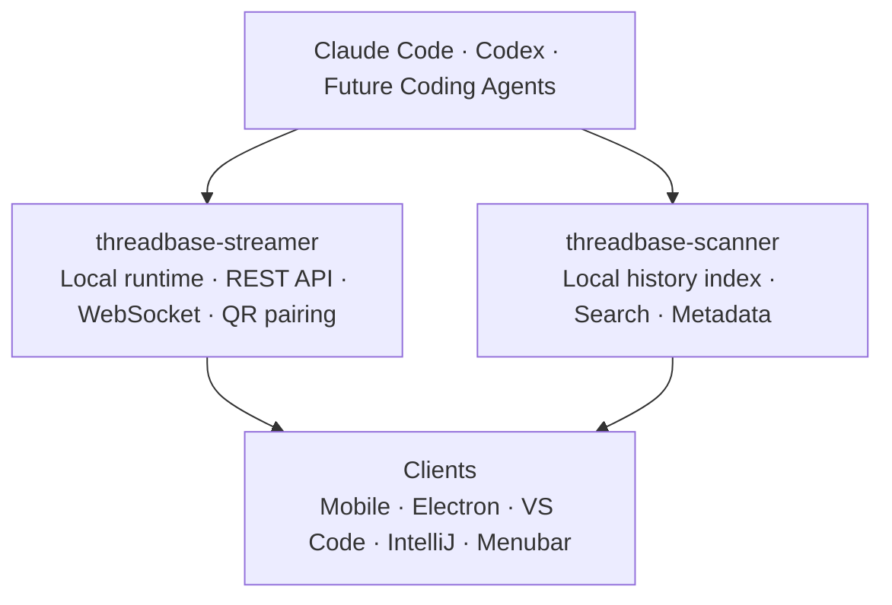

# Threadbase

**A local-first control plane for AI coding agents.**

Threadbase helps developers monitor, search, resume, and control local AI coding-agent sessions across mobile, desktop, IDEs, and local machines.

It connects to coding agents running on your own machine through [`threadbase-streamer`](https://github.com/RonenMars/threadbase-streamer), indexes local conversation history through [`threadbase-scanner`](https://github.com/RonenMars/threadbase-scanner), and exposes that workflow through mobile, desktop, and IDE clients.

This repository is the project hub for Threadbase. It does not contain the implementation source for each component. Each component lives in its own repository.

> 🌐 **Website:** [threadbase.sh](https://threadbase.sh)  
> 📲 **Mobile beta:** [threadbase.sh/betas](https://threadbase.sh/betas)  
> 🔒 **Privacy:** [threadbase.sh/privacy](https://threadbase.sh/privacy)

---

## What is Threadbase?

AI coding agents are becoming long-running, asynchronous development partners.

But the current workflow is still fragmented:

- sessions run in local terminals,
- history is hard to search,
- mobile supervision is awkward,
- each provider has its own interface,
- multi-agent workflows are difficult to coordinate.

Threadbase provides a local-first layer for observing, controlling, searching, and eventually orchestrating those agents.

The current focus is Claude Code and Codex, with an architecture designed around provider-aware session metadata and future provider expansion.

---

## Quick Start

1. Install `tb-streamer` on the machine running your AI coding agents.

   See: [threadbase-streamer](https://github.com/RonenMars/threadbase-streamer)

2. Start the streamer:

   ```bash
   tb-streamer start
   ```

3. Pair a mobile device:

   ```bash
   tb-streamer pair
   ```

4. Install Threadbase Mobile:

   [threadbase.sh/betas](https://threadbase.sh/betas)

5. Scan the QR code and start monitoring your sessions.

For detailed setup instructions, see:

- [`threadbase-streamer`](https://github.com/RonenMars/threadbase-streamer)
- [`threadbase-mobile`](https://github.com/RonenMars/threadbase-mobile)

---

## How it fits together



For a deeper architecture overview, see [`docs/architecture.md`](docs/architecture.md).

---

## What you can use today

| Component | What it does | Link |
|---|---|---|
| 📱 Threadbase Mobile | Monitor live sessions, queue prompts, search history, receive push notifications, and connect to multiple streamer instances | [Mobile beta](https://threadbase.sh/betas) · [Repo](https://github.com/RonenMars/threadbase-mobile) |
| 🖥️ Threadbase Streamer | Local runtime, REST API, WebSocket streaming, QR pairing, session control | [Repo](https://github.com/RonenMars/threadbase-streamer) |
| 🔍 Threadbase Scanner | Local conversation indexing, search, and provider metadata | [Repo](https://github.com/RonenMars/threadbase-scanner) |
| 🧩 Desktop and IDE clients | Electron, VS Code, IntelliJ, and menubar clients | [Repos](docs/repositories.md) |

---

## Repository map

| Repository | Purpose | Status |
|---|---|---|
| [`threadbase-streamer`](https://github.com/RonenMars/threadbase-streamer) | Local runtime, REST API, WebSocket streaming, QR pairing, session control | Active |
| [`threadbase-scanner`](https://github.com/RonenMars/threadbase-scanner) | Local conversation indexing, search, provider metadata | Active |
| [`threadbase-mobile`](https://github.com/RonenMars/threadbase-mobile) | iOS/Android client for monitoring and controlling sessions | Active beta |
| [`threadbase-electron`](https://github.com/RonenMars/threadbase-electron) | Desktop app for browsing, searching, and interacting with sessions | Active / evolving |
| [`threadbase-vscode`](https://github.com/RonenMars/threadbase-vscode) | VS Code extension for browsing and searching coding-agent history | Active |
| [`threadbase-intellij`](https://github.com/RonenMars/threadbase-intellij) | JetBrains plugin for browsing and searching coding-agent history | Active |
| [`threadbase-menubar`](https://github.com/RonenMars/threadbase-menubar) | Tray/menubar status indicator for Threadbase Streamer | Active / lightweight |

For the full repository map, including shared packages, orchestration, distribution, and historical repos, see [`docs/repositories.md`](docs/repositories.md).

---

## Documentation

| Document | Description |
|---|---|
| [`docs/README.md`](docs/README.md) | Documentation table of contents |
| [`docs/architecture.md`](docs/architecture.md) | Architecture diagrams, core layers, runtime/history flow, and orchestration overview |
| [`docs/repositories.md`](docs/repositories.md) | Full repository map, shared packages, experimental repos, distribution, and historical repos |
| [`docs/concepts.md`](docs/concepts.md) | Streamer, scanner, clients, providers, and orchestration concepts |
| [`docs/providers.md`](docs/providers.md) | Supported providers and provider-aware product guidance |
| [`docs/provider-research.md`](docs/provider-research.md) | Historical provider research and provider abstraction notes |
| [`docs/feature-comparison.md`](docs/feature-comparison.md) | Historical cross-client feature matrix; needs refresh |
| [`docs/client-architecture-principles.md`](docs/client-architecture-principles.md) | Cross-client domain → adapter → UI architecture principles |
| [`docs/privacy-and-security.md`](docs/privacy-and-security.md) | Local-first privacy model and security guidance |
| [`docs/roadmap.md`](docs/roadmap.md) | Current status, near-term roadmap, and longer-term ideas |
| [`docs/contributing.md`](docs/contributing.md) | Contribution areas and project participation guidance |
| [`docs/marketing/article-writing-guide.md`](docs/marketing/article-writing-guide.md) | Writing and launch-post guidance |
| [`docs/status/`](docs/status/) | Per-component status snapshots (historical) |

---

## Project focus

Threadbase focuses on:

- local-first developer control,
- searchable coding-agent history,
- lightweight streamer-based session access,
- mobile and IDE clients,
- provider-aware architecture,
- future durable multi-agent orchestration.

It is intentionally built as an open-source ecosystem rather than a single closed app.

---

## Contributing

See [`CONTRIBUTING.md`](CONTRIBUTING.md).

For implementation-specific issues, please prefer the relevant component repository.

---

## Security

See [`SECURITY.md`](SECURITY.md).

Threadbase controls local AI coding-agent sessions, so security issues should be reported privately.

---

## License

Threadbase source code is licensed under MIT unless otherwise noted.

See [`LICENSE`](LICENSE) and the `LICENSE` file in each component repository.

---

## Trademark

Threadbase is a trademark of Ronen Mars.

The MIT license applies to the source code, but it does not grant permission to use the Threadbase name or logo to market derivative projects, hosted services, or commercial products without permission.

See [`TRADEMARK.md`](TRADEMARK.md).
