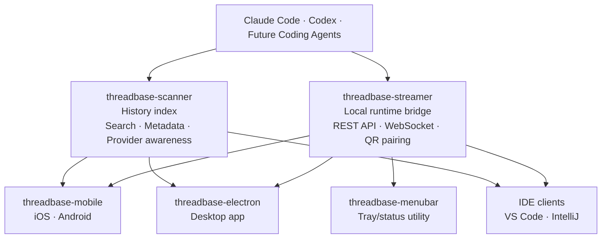
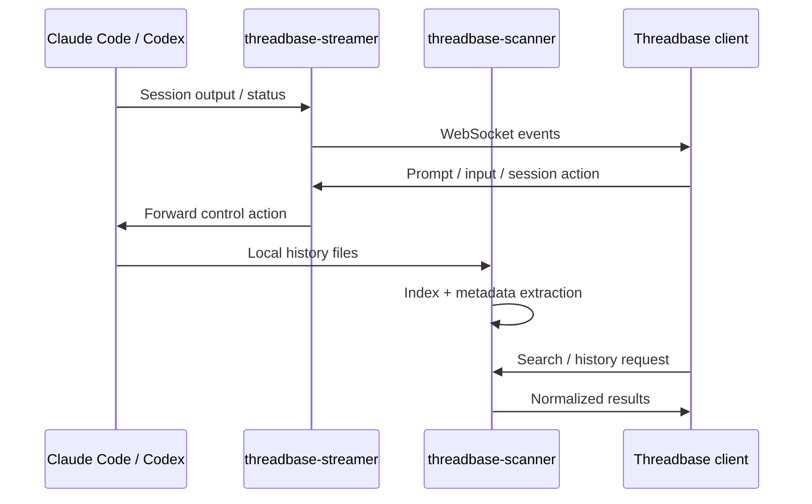
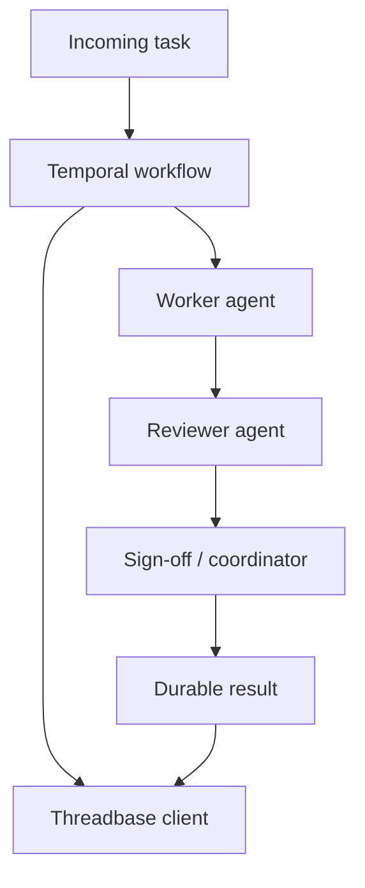

# Threadbase Architecture

Threadbase is structured as a local-first ecosystem around three core ideas:

1. Runtime control through `threadbase-streamer`
2. History and search through `threadbase-scanner`
3. Client surfaces across mobile, desktop, IDEs, and lightweight utilities

## Core architecture

## Runtime and history flow

## Orchestration experiments

This layer is experimental and separate from the core streamer/mobile flow.
